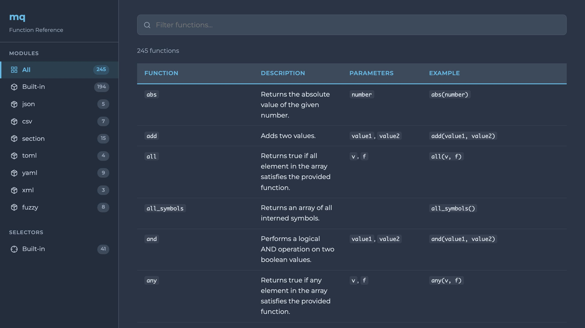

<h1 align="center">mq-docs</h1>

A documentation generator for [mq](https://github.com/harehare/mq) functions, macros, and selectors. Generates reference documentation from built-in definitions or custom `.mq` files in multiple output formats.



## Features

- Generates documentation for functions, macros, and selectors
- Multiple output formats: Markdown, plain text, and HTML
- HTML output includes interactive sidebar navigation, search/filter, and responsive design
- Supports built-in modules, custom files, and loadable modules (e.g., `csv`, `json`)
- Available as both a CLI tool and a library

## Installation

### Using the Installation Script (Recommended)

```bash
curl -fsSL https://raw.githubusercontent.com/harehare/mq-docs/main/bin/install.sh | bash
```

The installer will:
- Download the latest release for your platform
- Verify the binary with SHA256 checksum
- Install to `~/.mq-check/bin/`
- Update your shell profile (bash, zsh, or fish)

After installation, restart your terminal or run:
```bash
source ~/.bashrc  # or ~/.zshrc, or ~/.config/fish/config.fish
```

### Cargo

```bash
# Install from crates.io
cargo install mq-docs
# Install using binstall
cargo binstall mq-docs@0.1.0
```

### From Source

```bash
git clone https://github.com/harehare/mq-docs.git
cd mq-docs
cargo build --release
# Binary will be at target/release/mq-docs
```

## Usage

### CLI

```bash
# Generate documentation for built-in functions (default: Markdown)
mq-docs

# Generate from custom files
mq-docs file1.mq file2.mq

# Load specific modules
mq-docs -M csv -M json

# Include built-in functions alongside custom modules/files
mq-docs -B -M json file.mq

# Specify output format
mq-docs -F html > docs.html
mq-docs -F markdown > docs.md
mq-docs -F text
```

#### Options

| Option                      | Description                                                        |
| --------------------------- | ------------------------------------------------------------------ |
| `[FILES]`                   | Input `.mq` files to generate documentation from                   |
| `-M, --module-names <NAME>` | Module names to load (repeatable)                                  |
| `-F, --format <FORMAT>`     | Output format: `markdown`, `text`, or `html` (default: `markdown`) |
| `-B, --include-builtin`     | Include built-in functions alongside modules/files                 |

### Library

```rust
use mq_docs::{generate_docs, DocFormat};

fn main() -> miette::Result<()> {
    // Generate Markdown documentation for built-in functions
    let docs = generate_docs(&None, &None, &DocFormat::Markdown, false)?;
    println!("{docs}");
    Ok(())
}
```

## Output Formats

- **Markdown** - Tables suitable for rendering in documentation sites or GitHub
- **Text** - Plain text output for terminal viewing
- **HTML** - Self-contained single-page HTML with dark theme, sidebar navigation, search filtering, and mobile support

## License

MIT
